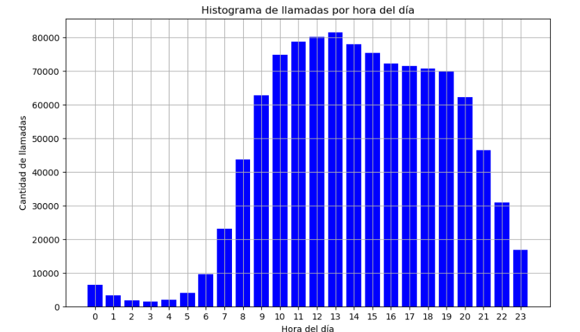

# Desafío Grandata

El objetivo del presente documento es documentar la solución propuesta al enunciado provisto en el archivo `technical_challenge.pdf`.

## Tecnologías y herramientas

- Python  
- Apache Spark  
- Jupyter Notebooks  
- Docker  
- WSL2 (Windows Subsystem for Linux)

## Estructura del proyecto

```bash
.
├── Solucion               
    ├── desafio.ipynb               # Notebook principal con el desarrollo
    ├── inputs/                
    │   ├── files/                  # Datasets de entrada
    │   └── config.json             # Archivo de configuración usado en la notebook
    ├── resultado/                
    │   ├── grafico.png             # Imagen del resultado del ejercicio 1.3
    │   └── resultado.gz.parquet    # Archivo resultado del ejercicio 1.1
├── technical_challenge.pdf         # Enunciado      
└── README.md                       # Este archivo
```

## Instalación y ejecución
Este proyecto fue desarrollado y probado en un entorno local Windows utilizando WSL2 y Docker Desktop.

Primero, instalar el subsistema de Linux (WSL2) con Ubuntu. Para ello, abrir PowerShell como administrador y ejecutar:

```bash
wsl --install -d Ubuntu
```

Luego, instalar Docker Desktop desde docker.com, asegurándose de habilitar el soporte para WSL2 e integración con Ubuntu.

Verificar que Docker esté correctamente instalado con:

```bash
docker --version
```

Posteriormente, descargar la imagen oficial de Jupyter con PySpark:

```bash
docker pull jupyter/pyspark-notebook:x86_64-ubuntu-22.04
```

Finalmente, iniciar el contenedor montando el directorio actual para compartir archivos:

```bash
docker run -p 8888:8888 -v "$PWD":/home/jovyan/work jupyter/pyspark-notebook:x86_64-ubuntu-22.04
```

Al ejecutarlo, se mostrará una URL con un token para acceder a JupyterLab en el navegador, típicamente en:

http://127.0.0.1:8888/lab?token=...

Los archivos locales estarán disponibles dentro del contenedor en la ruta /home/jovyan/work.

## Resultados: Ejercicio 1

A continuación se muestran los resultados generados por el análisis realizado en la notebook:

### Facturacion total por sms

391367

### 📊 Visualización de llamadas por hora



> El gráfico representa la cantidad total de llamadas realizadas por hora del día.

### 📁 Archivo resultante

Se generó un archivo en formato **Parquet** con los resultados procesados:

📎 [`resultado.gz.parquet`](./solucion/resultado/resultado.gz.parquet)

> Este archivo contiene los datos procesados.

## Respuestas al enunciado: Ejercicio 2

Para priorizar los procesos productivos sobre los análisis, recomiendendo configurar el CapacityScheduler de YARN con dos colas diferenciadas, asignando un 70%/30% a dos diferentes colas. Además, se se podrian limitar los recursos (CPU y memoria) por contenedor para evitar que un proceso monopolice el cluster y, cuando sea posible, programar los procesos más intensivos fuera del horario laboral.

En cuanto a la estrategia para administrar la ejecución intensiva de los procesos productivos, aconsejo dividir los datos en lotes pequeños para permitir ejecuciones en ventanas cortas y continuas, evitando cargas masivas que saturen los recursos. El uso de Delta Lake como formato de almacenamiento mejora la eficiencia en lectura y actualización de datos respecto a Parquet.

Entre las herramientas de scheduling: Apache Airflow (conocimiento basico), crontab para tareas simples y plataformas como Databricks.
